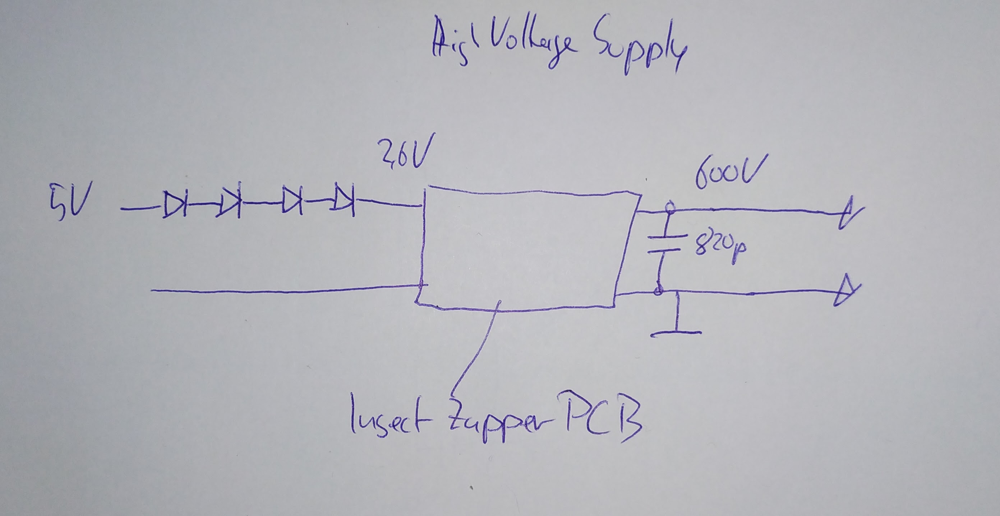
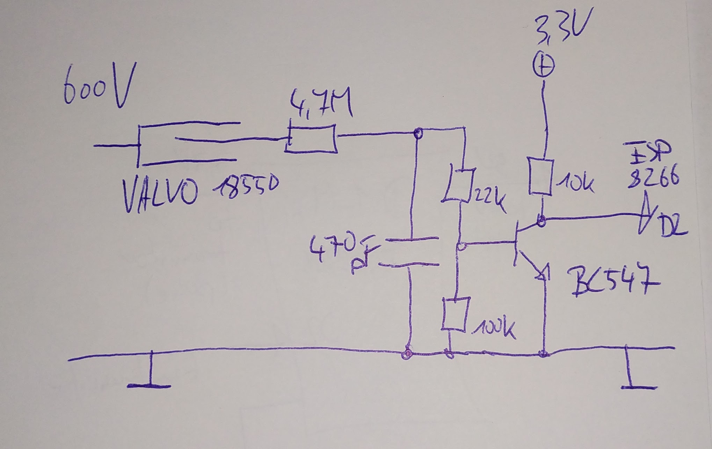
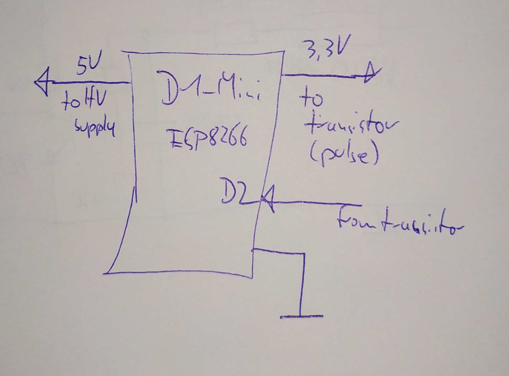
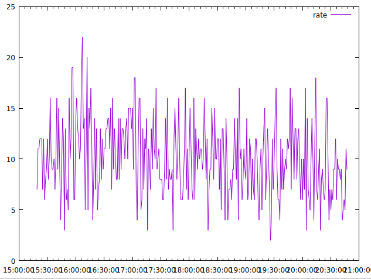
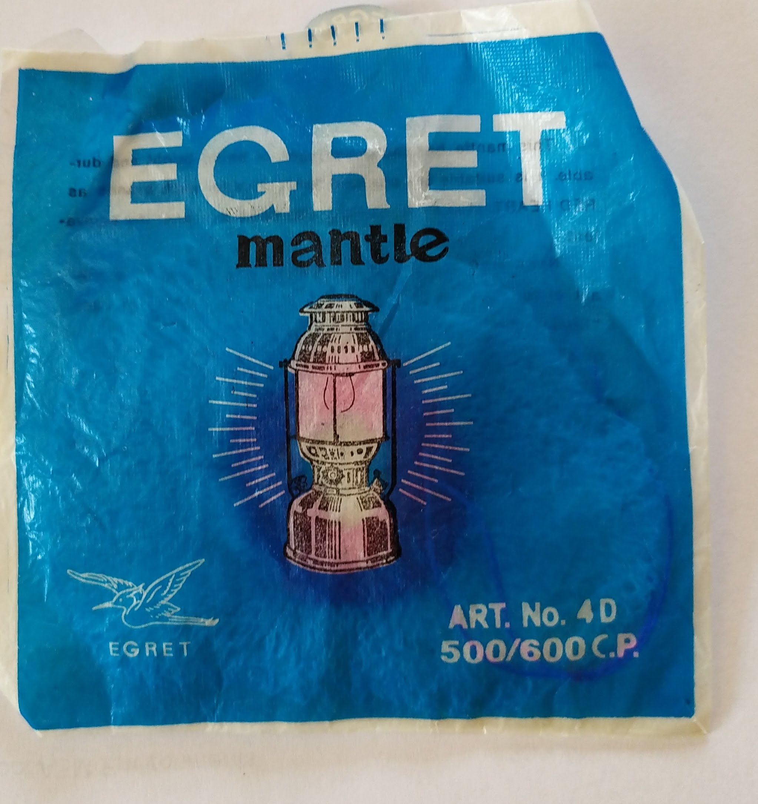
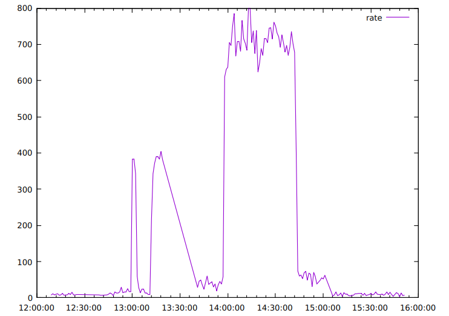

# WiFi Geiger counter / radioactivity monitor
For some reason i decided to build a radioactivity monitor with a Geiger tube i had lying around.
## Geiger tube
I had a FHZ76V unit lying around which essentially is a VALVO 18550/ZP1320 geiger tube in a metal mesh enclosure. 

A Geiger tube needs high voltage to operate, for the VALVO 18550 about 600V. Other tubes probably need a lower voltage, so consult the data sheet before continuing.
## High voltage power supply
Instead of building a high voltage source from scratch, a cheap insect zapper was disassembled. The circuit board puts out about 1000V using two AA cells (3V)  - which is to high for the VALVO tube. 

Reducing the input voltage with some diodes to about 2.4V gave 600V output - perfect! You have to experiment to get to the correct voltage for your tube. A high voltage capacitor was added in parallel to the output to keep the voltage reasonable stable. 
 

## Pulse
A particle crossing the geiger tube creates a high voltage/low current pulse across a 5M resistor. The pulse is fed via a RC-circuit to a NPN transistor (using a voltage divider) which pulls the output down. This is used to count the impulse from a ESP8266.

 

## Counter
The [ESPHome home automation software](https://esphome.io/index.html) was leveraged to count the impulses. ESPHome software is deployed to ESP8266 (or ESP32 and other) nodes via WiFi. Node configuration is done entirely with YAML files over a web frontend. The nodes can be used over the web frontend or standalone via [http requests](https://esphome.io/web-api/index.html) enabling scripting. A generic ESPHome counter node was used and is polled with curl requests from a cron script.

 

## Testing with Thorium
### Null rate
To estabish a base line we need a null rate. There is always some background radiaoactivity which results in a null rate of about 12 counts/minute for my geiger tube. The null rate differs by location and by the the geiger tube model.

 

### Gas mantle
To test the geiger counter a source of radioactivity is needed. I used thorium. Thorium is contained in old (manufactured before 2000) gas mantles, see https://en.wikipedia.org/wiki/Gas_mantle and emits alpha and beta radiation. Putting an old gas mantle directly next to the geiger tube increased the rate to about 600 counts/minute - which is quite substantial. You can buy them from eBay but you have to take care to get an old one which is slighly radioactive.

 

### Plot with gas mantle

 

You can see the sharp rate changes from adding/removing the gas mantle.

## Uranium glass

[Uranium glass](https://en.wikipedia.org/wiki/Uranium_glass) (sometimes called vaseline glass) also can be used for testing. It is a very weak alpha radiation emitter and can be bought easily from eBay or other sources.

## Scripts & sample data

### Some scripts are provided:

* Shell script to get the data from sensor to a csv file
* Sample data for null rate and with thorium
* Gnuplot scripts to plot results from csv files, usage: `gnuplot -p geiger.gnuplot`

### Data sheets

Data sheets for some VALVO tubes can be found here: https://frank.pocnet.net/other/Valvo/Valvo_Zaehlrohre_1977.pdf
